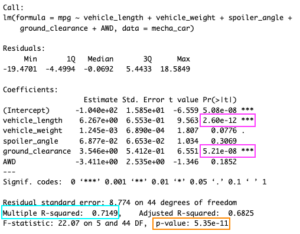
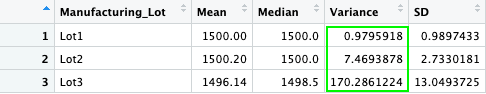
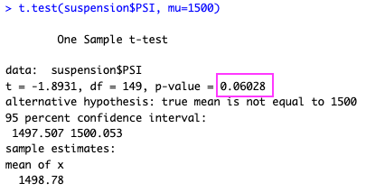
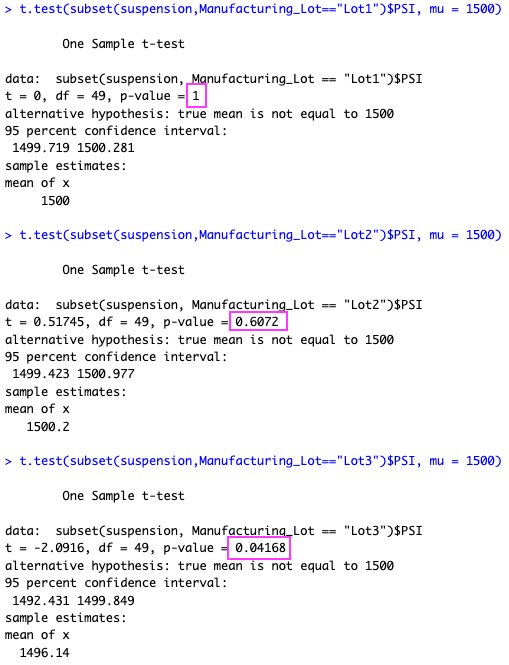

# MechaCar Statistical Analysis

## Linear Regression to Predict MPG

* There are two variables in the dataset. vehicle length and ground clearance, that have a significant non-random effect on mpg according to the linear model. The p-values for these variables were 2.60e-12 and 5.21e-08, respectively, which are significant at the p-value < 0 level. 
* The p-value for the linear model is well below the common signifance level of 0.05. Since the p-value is less than 0.05, the null hypothesis can be rejected and the slope of the linear model is considered to be non-zero. 
* The r-squared value for the linear model is 0.7145, which indicates that 71% of the variability in mpg is explained by the model. This degree of fitness, while not great, does effectively predict mpg of MechaCar prototypes. 

## Summary Statistics on Suspension Coils

* The total summary statistics for the suspension coil data shows that the variance of PSI is 62.29 across all manufacturing lots. This is within the design specifications. However, variance of individual manufacturing lots is quite different (see below). The variance for Lot 1 and Lot 2 are quite low at 0.98 and 7.47, respectively. Again, within the design specifications. Lot 3 is outside design specifications with a variance of 170.29. 

## T-Tests on Suspension Coils

* The T-test for all manufacturing lots indicates that the sample mean (1498.78) is not significantly different than the population mean of 1500. The p-value of 0.06 is greater than 0.05, which means the null hypothesis cannot be rejected. 

* The T-test for Lot 1 indicates that the sample mean (1500) is not significantly different than the population mean. The p-value is 1 and the null hypothesis cannot be rejected.
* The T-test for Lot 2 indicates that the sample mean (1500.2) is not significantly different from the population mean. The p-value is 0.61 which is greater than 0.05, therefore, the null hypothesis cannot be rejected.
* The T-test for Lot 3 indicates that the sample mean (1496.14) is significantly different from the population mean of 1500. The p-value is 0.042 which is less than the significance level of 0.05 and therefore the null hypothesis can be rejected. 
* Reviewing all of the results shows that manufacturing at Lot 3 is not consistent with other locations. 

## Study Design: MechaCar vs Competition
Consumers consider a variety of factors when selecting a vehicle. One such consideration is towing capacity. This study will determine if the towing capacity of the MechaCar is statistically different than the mean towing capacity of similar competitor's vehicles. 

### Metric
Towing capacity in pounds (lbs)

### Null and Alternative Hypothesis
Ho: The mean towing capacity for MechaCar prototypes and it's competitors is equal.
Ha: The mean towing capacity for MechaCar prototypes and it's competitors is NOT equal.

### Statistical Test
For this analysis, a two sample t-test would be appropriate because we are comparing the means of two groups: the MechaCar prototypes and the competitor's mean towing capacities. 

### Data Needed
To perform this analysis, the towing capacity (in lbs) for MechaCar prototypes will need to be gathered as well as the towing capacity (in lbs) for similar competitor vehicles.
